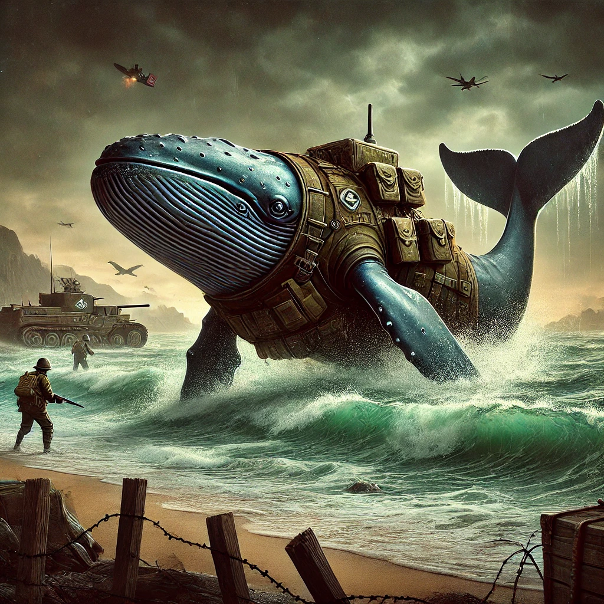

# Introduction

This project was born out of a desire to combine nostalgia with modern DevOps practices. As someone who used to enjoy playing Wolfenstein: Enemy Territory with friends, I saw an opportunity to take this classic game and use it as a platform to deepen my skills in Kubernetes and apply modern CI/CD techniques to an application that predates them.

**Technical Challenge**: By containerizing and orchestrating a game server like ET Legacy with Docker and Kubernetes, I aimed to modernize a legacy application. This involved adapting an older application to run in a cloud-native environment, automating its deployment, and managing it with the same tools and methodologies used in contemporary software development. By implementing a fully automated CI/CD pipeline, integrating environment variables with dynamic configuration management, and ensuring smooth deployment through Docker Compose and Kubernetes it demonstrates how to approach complex challenges, adapt legacy systems, and drive efficiency through automation.

## Instructions
### [Running Locally](docs/local-dev.md)
### [Deploying with Kubernetes](k8s/README.md)

## Note on Docker Image Choice

I chose not to use the official ET Legacy Docker image because it did not provide the portability that I was aiming for. To achieve this, I built the image from scratch, ensuring that all necessary game assets and dependencies were downloaded directly from **id Software** during the build process. This approach provides a self-sufficient, portable image that simplifies deployment and maintains consistency across different environments.

## Special Thanks and Acknowledgements
 - The community over at [ET Legacy](https://www.etlegacy.com/) for keeping the game alive and open-source. 
 - The [Docker](https://www.docker.com/) and [Kubernetes](https://kubernetes.io/) communities for providing the tools and resources to make it possible to modernize a legacy application like Enemy Territory. 
 - And of course, the original creators of [Wolfenstein: Enemy Territory](https://en.wikipedia.org/wiki/Wolfenstein:_Enemy_Territory) for making such a fun game that still has a dedicated following to this day.
 - Images Generated with ChatGPT from OpenAI                
