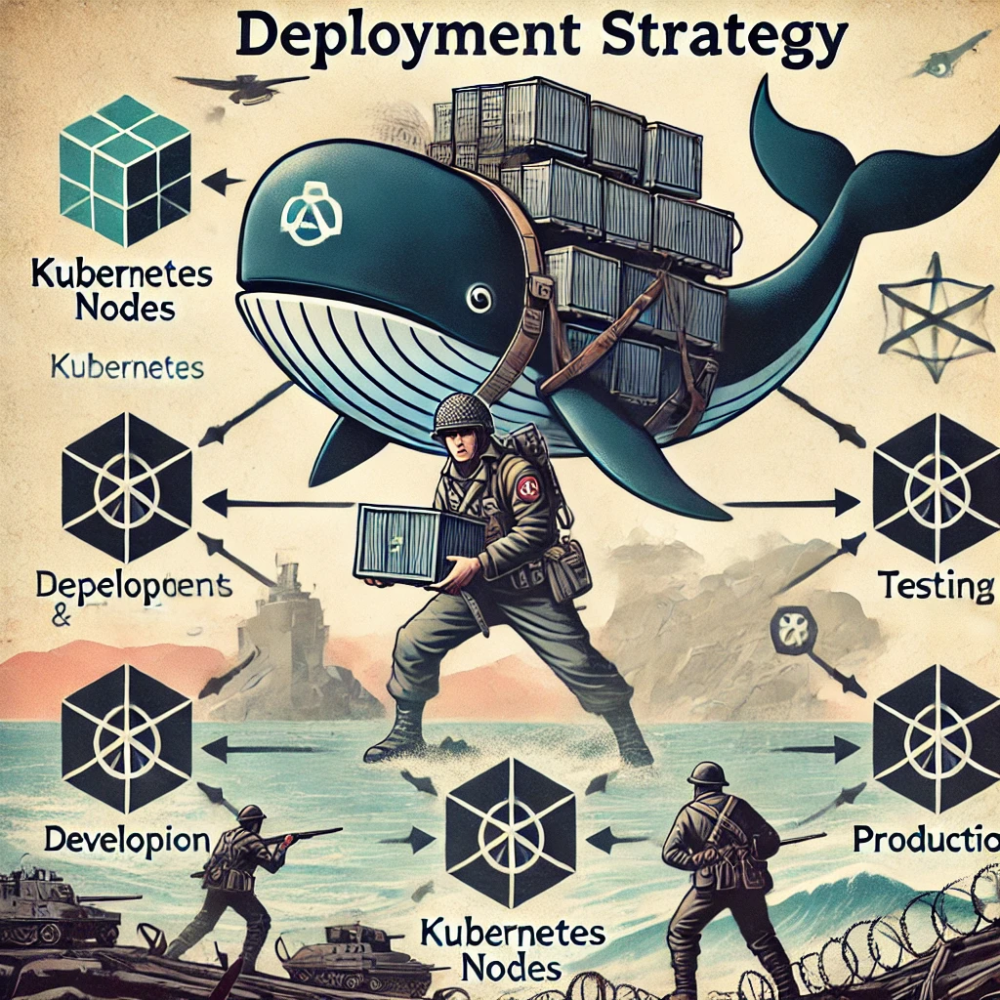

# ET Legacy Server with Docker Compose

This README provides instructions for bringing up an ET Legacy server locally using Docker Compose, connecting to the server from another installed copy of ET Legacy, and configuring the server using environment variables.

## Prerequisites

- **Docker** and **Docker Compose** installed on your local machine.
- A working installation of **ET Legacy** on your local machine or another client machine. You can download ET Legacy from the [official website](https://www.etlegacy.com/download). Note: The installers are recommended over the archives for ease of use.

## Setting Up and Running the Server

### Step 1: Clone the Repository

### Step 2: Prepare the Environment Variables (if needed)

1. **A working sample `env` file**: has been provided

    Update the `env` file with your desired settings (optional). For example:

    ```dotenv
    ET_HOSTNAME=LOCAL DEV ET
    ET_REFEREEPASSWORD=Start123!
    ET_RCONPASSWORD=Start123!
    ```

2. **Template Configuration File**: The `etl_server.cfg.template` file contains placeholders for environment variables. To add more, you would add a variable to your env file and then add an entry to template file. For example:

    ```plaintext
    // Server settings
    set sv_hostname "${ET_HOSTNAME}"                             
    set rconpassword "${ET_RCONPASSWORD}"        
    set refereePassword "${ET_REFEREEPASSWORD}"  
    ```

### Step 3: Start the Server with Docker Compose

1. **Run Docker Compose**: Bring up the server using Docker Compose:

    ```bash
    docker-compose up
    ```

    This command will build the Docker image (if necessary) and start the ET Legacy server in a detached mode.

2. **Check the Server IP**: To connect to the server, you need to know the IP address that Docker is listening on. You can find this by running:

    ```bash
    docker inspect -f '{{range .NetworkSettings.Networks}}{{.IPAddress}}{{end}}' wolfenstein-et-server-1
    ```


### Step 4: Connect to the Server from ET Legacy Client

1. **Open ET Legacy**: Start ET Legacy on your local machine.

2. **Connect to the Server**: Use the following command to connect to the running Docker server:

    ```bash
    ./etl.x86_64 +connect <docker_ip>
    ```

    Replace `<docker_ip>` with the IP address you retrieved in Step 3.2.

    Example:

    ```bash
    ./etl.x86_64 +connect 192.168.1.100
    ```

These variables are defined in `env` and applied to `etl_server.cfg` using `envsubst`.

### Additional Commands

- **Stopping the Server**: To stop the server, use:

    ```bash
    docker-compose down # or ctrl+c if running in the foreground 
    ```

- **Viewing Logs**: To view the server logs:

    ```bash
    docker-compose logs -f
    ```


# Note about Environment Variables
**Substitute Environment Variables**: `envsubst` is used to generate the final configuration file as part of `start.sh`: that is run when the container starts. This allows you to define environment variables in the `env` file and have them automatically applied to the configuration file. For example, the following command:

    ```bash
    envsubst < etl_server.cfg.template > etl_server.cfg
    ```

This command replaces placeholders in `etl_server.cfg.template` with actual values from your `.env` file and creates `etl_server.cfg`.

# Note about the Volume Mount for Data Persistence
The game uses a .etlegacy folder stored in the root user's home directory to store configuration files, logs, and other data. This folder is mounted as a volume in the base of the repo folder to persist data across container restarts. If you want to reset the server to its default state, you can delete the `.etlegacy` folder in repo folder as a super user.

### Troubleshooting

- **Unable to Connect**: 
    - Ensure your firewall allows traffic on the appropriate port (`27960` by default) and that you're using the correct IP address.
    - Are you trying to use `localhost`? If so, you may need to use the Docker host IP instead. You can find the IP with the docker command listed above
- **RCON Commands Not Working**: 
    -Double-check the `rconpassword` in `etl_server.cfg` and ensure it matches what you’re using in-game. Also before trying to us an rcon command ensure that you authenticate in the console with `/rconpassword <rconpassword>`.
    - docker exec into the container and cat the etmain/etl_server.cfg file to ensure the rconpassword is set correctly in the file.

### Conclusion

You now have a locally running ET Legacy server that you can connect to from any ET Legacy client. The server is fully configurable via environment variables, allowing for easy customization and deployment.

